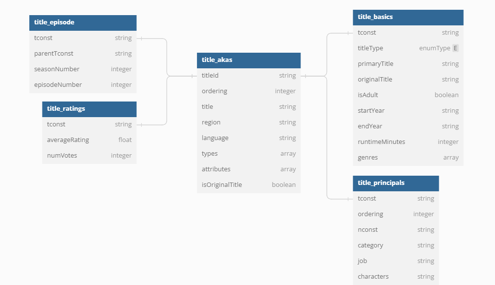

# AWS Data ETL Pipeline | Data Engineering Project

Building an end-to-end batch processing data pipeline using Amazon Web Services (AWS)

## AWS Services Used
* S3
* Glue
* Managed Apache Airflow
* Athena
* Simple Queue Service (SQS)
* Lambda
* IAM

## Architecture

1. Using Airflow, datasets are downloaded and stored in S3
2. Glue ETL Job is then triggered to convert CSV to parquet
3. Processed data is stored in s3 and tables are created in dB
4. Athena is used for querying the tables and creating views
5. Views can be then extracted in tableau for dashboarding

NOTE: Incremental Datasets when added to s3, get automatically added to DB using SQS, Lambda, and Glue crawler. 
This can then be used to create joins with IMDb datasets in Athena  

## Dataset
IMDb Non-Commercial Datasets are available for access to anyone for personal and non-commercial use.

Datasets: https://datasets.imdbws.com/

Data Dictionary: https://developer.imdb.com/non-commercial-datasets/

## Data Model

## Running Airflow Locally
Dockerfile: This file contains a versioned Astro Runtime Docker image that provides a differentiated Airflow experience

Start Airflow on your local machine by running 

    astro dev start

This command will spin up 4 Docker containers on your machine, each for a different Airflow component:

* Postgres: Airflow's Metadata Database
* Webserver: The Airflow component responsible for rendering the Airflow UI
* Scheduler: The Airflow component responsible for monitoring and triggering tasks
* Triggerer: The Airflow component responsible for triggering deferred tasks

Access the Airflow UI for your local Airflow project. To do so, go to http://localhost:8080/ and log in with 'admin' for both your Username and Password.

## Repository Structure
- dags: This folder contains the Python files for your Airflow DAGs. 
    - `imdb_data_ingestion.py`: This DAG shows the IMDb ETL data pipeline.
- requirements.txt: Python packages needed for this project
- scripts: Contains the glue ETL job script
- .github/workflows: contains the .yml file that is used by github actions (CI/CD)
